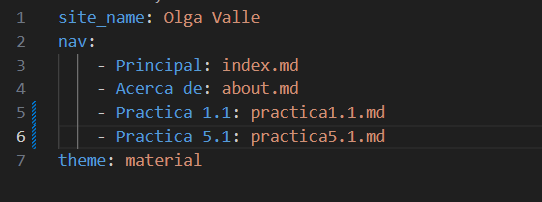
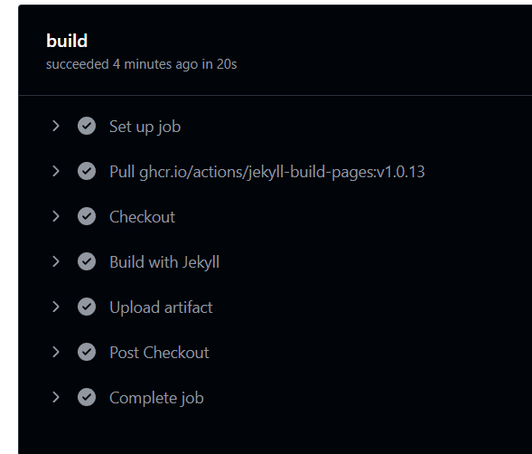
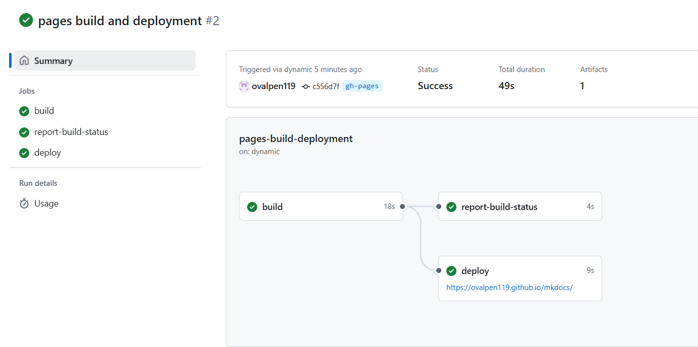
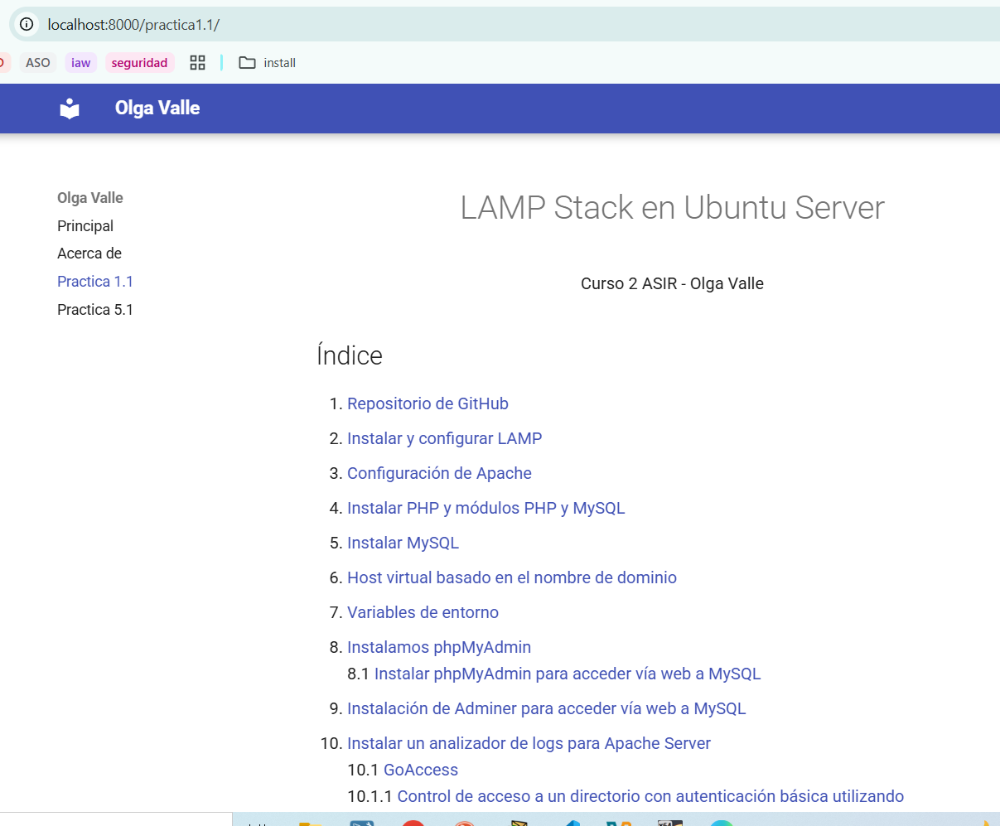
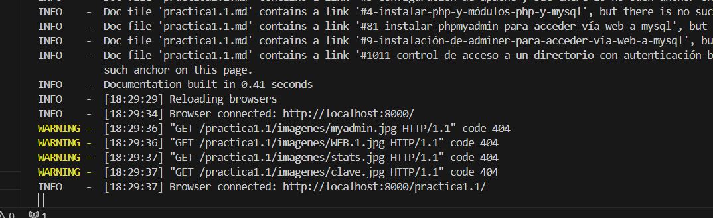

# mkdocs
Ejecutamos 

docker run --rm -it -p 8000:8000 -u $(id -u):$(id -g) -v "$PWD":/docs squidfunk/mkdocs-material new .

Configuración en mkdocs.yml
Una vez creado el archivo mkdocs.yml podremos editarlo para ir configurando nuestro sitio web

